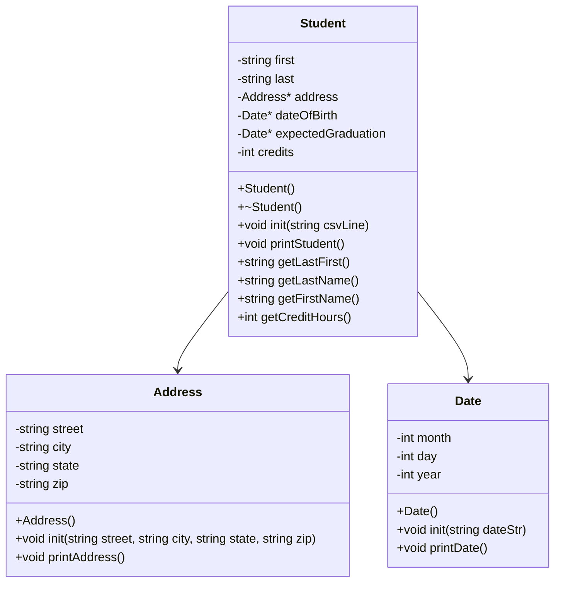

# Heap of Students - Part 2

**Name:** Steven Houser  
**Course:** CS 121 - Data Structures & Objects  
**Date:** 03/06/26

---

## UML Diagram

---

## Program Description

This program loads student data from `students.csv` into a vector of `Student*` pointers. Each `Student` owns heap-allocated `Address` and `Date` objects. A numbered menu lets the user print all names, print full student data, or search by last name (partial matches). Memory is cleaned up with a destructor inside `Student` and a `delStudents` function that deletes each pointer before exit.

---

## Algorithm

**Goal:** Load students from a CSV file into a vector of heap-allocated `Student` objects, then provide a menu to display names, full data, or search results. Clean up all heap memory before exit.

### Date class

`Date() constructor`
- Set month = 0, day = 0, year = 0 as safe defaults

`init(dateStr)`
- Load dateStr into a stringstream
- Use getline with '/' delimiter to extract sMonth, sDay, sYear as strings
- Use a converter stringstream to convert each string token to int
- Store results in month, day, year

`printDate()`
- Output month/day/year in MM/DD/YYYY format

---

### Address class

`Address() constructor`
- Set all string members to empty strings as safe defaults

`init(street, city, state, zip)`
- Assign each parameter directly to the matching member variable

`printAddress()`
- Output all fields on one line: street, city, state zip

---

### Student class

`Student() constructor`
- Set first = "", last = "", credits = 0 as safe defaults
- Allocate heap objects: address = new Address(), dateOfBirth = new Date(), expectedGraduation = new Date()

`~Student() destructor`
- delete address
- delete dateOfBirth
- delete expectedGraduation

`init(csvLine)`
- Load csvLine into a stringstream
- Use getline with ',' delimiter to extract tokens in order:
    - first, last, street, city, state, zip, birthStr, gradStr, sCredits
- Call address->init(street, city, state, zip) to set up the Address object
- Call dateOfBirth->init(birthStr) and expectedGraduation->init(gradStr) to set up the Date objects
- Use a converter stringstream to convert sCredits to int

`printStudent()`
- Print last, first on first line
- Call address->printAddress()
- Print "Born: " and call dateOfBirth->printDate()
- Print "Grad: " and call expectedGraduation->printDate()
- Print credits

`getLastFirst()`
- Return last + ", " + first as a formatted string

`getLastName()`
- Return last

`getFirstName()`
- Return first

`getCreditHours()`
- Return credits

---

### Main program functions

`loadStudents(vector&lt;Student*&gt;& students)`
- Open students.csv with ifstream
- While getline(infile, currentLine): create Student* s = new Student(), call s->init(currentLine), push s onto students
- Close file

`showStudentNames(vector&lt;Student*&gt;& students)`
- For each Student* in students: print student->getLastFirst()

`printStudents(vector&lt;Student*&gt;& students)`
- For each Student* in students: call student->printStudent(), print blank line between students

`findStudent(vector&lt;Student*&gt;& students)`
- Prompt user for search string
- For each Student*: if student->getLastName().find(searchTerm) != std::string::npos, call student->printStudent()

`delStudents(vector&lt;Student*&gt;& students)`
- For each Student* in students: delete student
- Call students.clear()

`menu()`
- Print numbered options: 0) quit, 1) print all student names, 2) print all student data, 3) find a student, 4) sort by last name, 5) sort by first name, 6) sort by credit hours (descending)
- Read user input as string with getline(cin, choice)
- Return choice

`main()`
- Create std::vector&lt;Student*&gt; students
- Call loadStudents(students)
- Loop: call menu(), if "0" call delStudents(students) and break, else dispatch to showStudentNames, printStudents, or findStudent based on choice

---

### Blackbelt: Sorting

`sortByLast(a, b)`
- Return a->getLastName() < b->getLastName()

`sortByFirst(a, b)`
- Return a->getFirstName() < b->getFirstName()

`sortByCreditsDesc(a, b)`
- Return a->getCreditHours() > b->getCreditHours() (descending: most credits first)

`Menu options 4, 5, 6`
- Call std::sort(students.begin(), students.end(), comparator), then showStudentNames(students)

---

## Build Instructions

- **Build:** `make`
- **Run:** `make run`
- **Clean:** `make clean`
- **Debug:** `make debug`
- **Valgrind:** `make valgrind`
